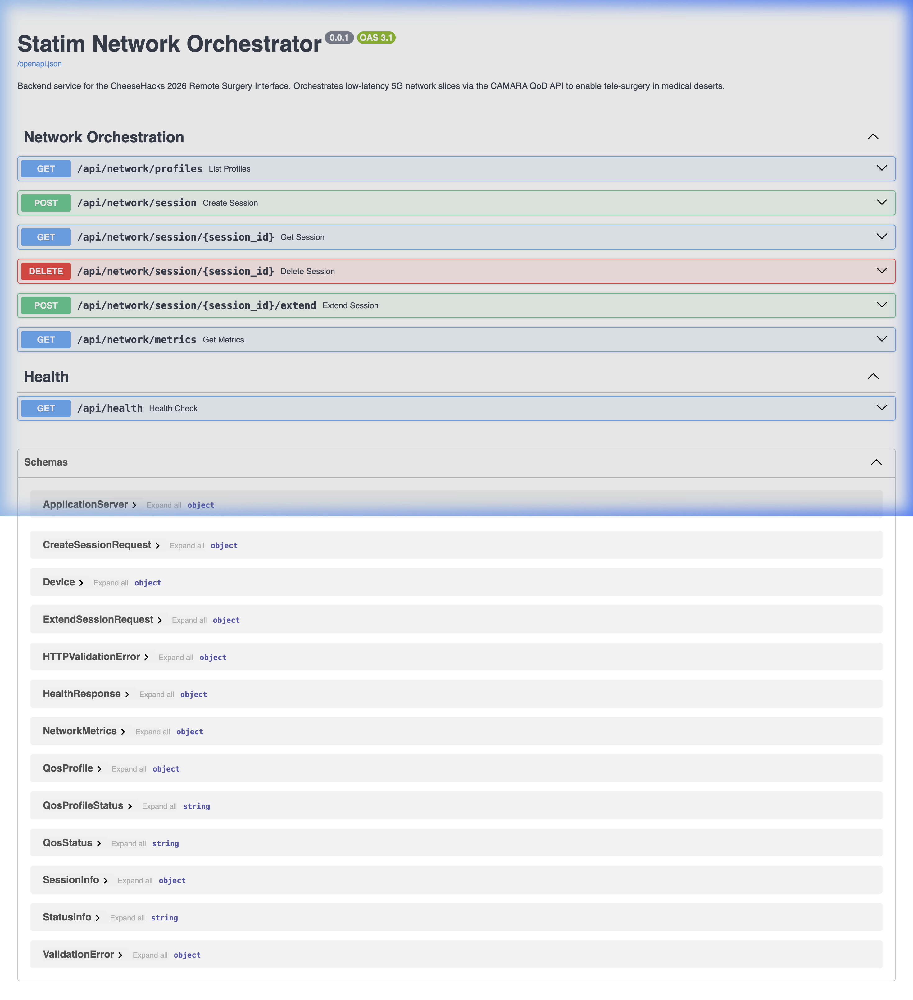

# 🏥 Statim — Network Orchestrator Backend

> **CheeseHacks 2026** · Backend API for the Remote Surgery Interface

FastAPI backend that orchestrates low-latency **5G network slices** via the [CAMARA Quality on Demand API](https://github.com/camaraproject/QualityOnDemand), enabling real-time tele-surgery across medical deserts.



---

## ✨ Features

| Feature | Description |
|---|---|
| **CAMARA QoD Integration** | Full client for the CAMARA Quality on Demand API — create, extend, and tear down 5G network slices with a single REST call |
| **Simulation Mode** | Built-in simulator produces realistic fluctuating metrics (latency, jitter, throughput, packet loss) — no telecom sandbox needed |
| **Live Metrics** | Real-time network telemetry endpoint that reflects slice quality (enhanced vs. degraded) |
| **Swagger Docs** | Auto-generated interactive API docs at `/docs` |
| **Dual Mode** | Seamlessly switch between simulation and live CAMARA API via environment variables |

---

## 📁 Project Structure

```
statim-backend/
├── main.py                  # FastAPI app entry point + health endpoint
├── config.py                # Pydantic settings (env vars / .env)
├── requirements.txt         # Python dependencies
├── .env.example             # Template environment config
├── models/
│   └── schemas.py           # Pydantic models (CAMARA data structures)
├── routers/
│   └── network.py           # REST API endpoints (/api/network/*)
├── services/
│   ├── orchestrator.py      # Facade — delegates to simulator or CAMARA
│   ├── simulator.py         # In-memory QoD simulator with realistic metrics
│   └── camara_client.py     # Real CAMARA QoD API HTTP client (OAuth2)
└── docs/
    └── swagger-ui.png       # API documentation screenshot
```

---

## 🚀 Quick Start

### Prerequisites

- Python 3.11+
- pip

### Installation

```bash
# Clone the repository
git clone https://github.com/Cristofer-Silva/statim-backend.git
cd statim-backend

# Create a virtual environment
python -m venv venv
source venv/bin/activate   # On Windows: venv\Scripts\activate

# Install dependencies
pip install -r requirements.txt

# Copy and configure environment
cp .env.example .env
```

### Run the server

```bash
uvicorn main:app --reload --port 8000
```

The API will be available at:
- **API Base**: http://localhost:8000/api
- **Swagger Docs**: http://localhost:8000/docs
- **ReDoc**: http://localhost:8000/redoc

---

## 📡 API Endpoints

### Health Check

| Method | Endpoint | Description |
|--------|----------|-------------|
| `GET` | `/api/health` | Server status, operating mode, and CAMARA endpoint |

### Network Orchestration

| Method | Endpoint | Description |
|--------|----------|-------------|
| `GET` | `/api/network/profiles` | List available QoS profiles |
| `POST` | `/api/network/session` | Create a 5G network slice (activate QoD) |
| `GET` | `/api/network/session/{id}` | Get session status |
| `POST` | `/api/network/session/{id}/extend` | Extend an active session |
| `DELETE` | `/api/network/session/{id}` | Tear down the network slice |
| `GET` | `/api/network/metrics` | Real-time network quality telemetry |

### Example: Create a Network Slice

```bash
curl -X POST http://localhost:8000/api/network/session \
  -H "Content-Type: application/json" \
  -d '{
    "applicationServer": {"ipv4Address": "192.168.1.100"},
    "device": {"ipv4Address": "10.0.0.1"},
    "qosProfile": "QOS_E",
    "duration": 3600
  }'
```

**Response:**
```json
{
  "sessionId": "a1b2c3d4-...",
  "qosProfile": "QOS_E",
  "qosStatus": "AVAILABLE",
  "duration": 3600,
  "startedAt": "2026-03-01T08:00:00Z",
  "expiresAt": "2026-03-01T09:00:00Z"
}
```

### Example: Get Real-Time Metrics

```bash
curl http://localhost:8000/api/network/metrics
```

**Without slice (degraded):**
```json
{
  "latencyMs": 87.3,
  "jitterMs": 18.2,
  "throughputMbps": 22.5,
  "packetLossPct": 1.234,
  "signalStrengthDbm": -72,
  "sliceActive": false
}
```

**With active QOS_E slice (enhanced):**
```json
{
  "latencyMs": 8.4,
  "jitterMs": 0.9,
  "throughputMbps": 105.2,
  "packetLossPct": 0.008,
  "signalStrengthDbm": -48,
  "sliceActive": true,
  "qosProfile": "QOS_E"
}
```

---

## 📊 QoS Profiles

| Profile | Latency | Throughput | Use Case |
|---------|---------|------------|----------|
| **QOS_E** | ≤ 10 ms | ≥ 50 Mbps | Ultra-low latency — real-time tele-surgery |
| **QOS_S** | ≤ 25 ms | ≥ 25 Mbps | Low latency — assisted diagnostics |
| **QOS_M** | ≤ 50 ms | ≥ 10 Mbps | Medium — video consultation |
| **QOS_L** | ≤ 100 ms | ≥ 5 Mbps | Standard — data transfer & telemetry |

---

## ⚙️ Configuration

All configuration is via environment variables (or `.env` file):

| Variable | Default | Description |
|----------|---------|-------------|
| `CAMARA_API_BASE_URL` | *(empty)* | CAMARA QoD API URL. Leave empty for simulation mode |
| `CAMARA_CLIENT_ID` | *(empty)* | OAuth2 client ID for CAMARA API |
| `CAMARA_CLIENT_SECRET` | *(empty)* | OAuth2 client secret |
| `CAMARA_TOKEN_URL` | *(empty)* | OAuth2 token endpoint |
| `SIM_BASE_LATENCY_MS` | `10.0` | Base latency in simulation mode |
| `SIM_JITTER_RANGE_MS` | `4.0` | Jitter range in simulation mode |
| `CORS_ORIGINS` | `["http://localhost:5173"]` | Allowed CORS origins |
| `DEBUG` | `true` | Enable debug logging |

### Simulation vs. Live Mode

- **Simulation** (default): Leave `CAMARA_API_BASE_URL` empty. The backend generates realistic fluctuating metrics without any external API.
- **Live**: Set `CAMARA_API_BASE_URL` to a real operator sandbox (e.g., Deutsche Telekom, Telefónica Open Gateway) along with OAuth2 credentials.

---

## 🏗️ Architecture

```
┌─────────────────┐     ┌──────────────────────┐
│  Frontend (React │────▶│  FastAPI Application  │
│  Next.js / Vite) │     │                      │
└─────────────────┘     │  ┌────────────────┐  │
                        │  │  /api/network/* │  │
                        │  │    (Router)     │  │
                        │  └───────┬────────┘  │
                        │          │           │
                        │  ┌───────▼────────┐  │
                        │  │  Orchestrator   │  │
                        │  │   (Facade)      │  │
                        │  └──┬──────────┬──┘  │
                        │     │          │     │
                        │  ┌──▼───┐  ┌───▼──┐  │
                        │  │ Sim  │  │CAMARA│  │
                        │  │ Mode │  │Client│  │
                        │  └──────┘  └──┬───┘  │
                        └───────────────┼──────┘
                                        │
                              ┌─────────▼─────────┐
                              │  Telecom Operator  │
                              │  (CAMARA QoD API)  │
                              └───────────────────┘
```

---

## 🔗 Related

- **Frontend**: [Cristofer-Silva/statim](https://github.com/Cristofer-Silva/statim) — React surgical console UI
- **Live Demo**: [cristofer-silva.github.io/statim](https://cristofer-silva.github.io/statim/)
- **CAMARA Project**: [camaraproject/QualityOnDemand](https://github.com/camaraproject/QualityOnDemand)

---

## 📄 License

Built for **CheeseHacks 2026** 🧀
